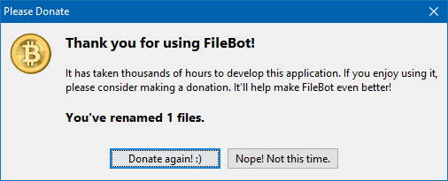

# FileBot - No Donate

After being bothered every time I used the program, I decided to do something about it.

I have nothing against *donations*, but this kind of approach I find particularly annoying.

## Requirements
* [FileBot 4.7.9](https://sourceforge.net/projects/filebot/files/filebot/FileBot_4.7.9/)

## How to install on Windows 10

Just replace the files below in the folder `%ProgramFiles%\FileBot`.
* filebot.launcher.l4j.ini
* filebot.platform.launcher.l4j.ini

## How to install on Linux

DEB version: `sudo nano /usr/share/filebot/filebot.sh`  
Portable version: Find the **filebot.sh** file in your portable folder

* Add `-Dapplication.update="skip"` in the last line, after `java` and before `$JAVA_OPTS` (or just replace with **filebot.sh**)

If you having *openjfx* errors, try using [this](https://github.com/frekele/oracle-java/releases/tag/8u212-b10) java version.
If you don't want to change java alternatives, download the [.tar.gz](https://github.com/frekele/oracle-java/releases/download/8u212-b10/jre-8u212-linux-x64.tar.gz) version and just place the java inside it in the filebot folder (either */usr/share/filebot/* or portable). Then update the **filebot.sh** and add `./` before the java in the last line (so you will use that java version).

## Troubleshooting

If your rename history is too large, you may also need to delete the file `history.xml` in the folder `%APPDATA%\FileBot`.
